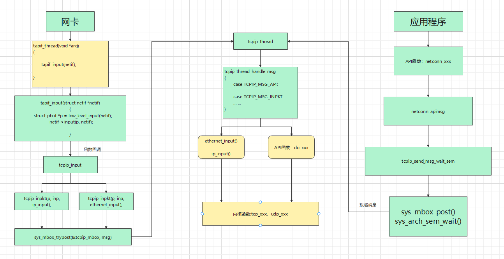
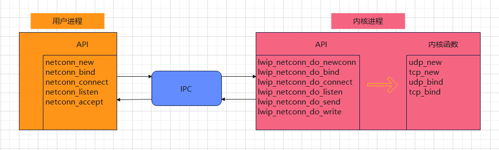
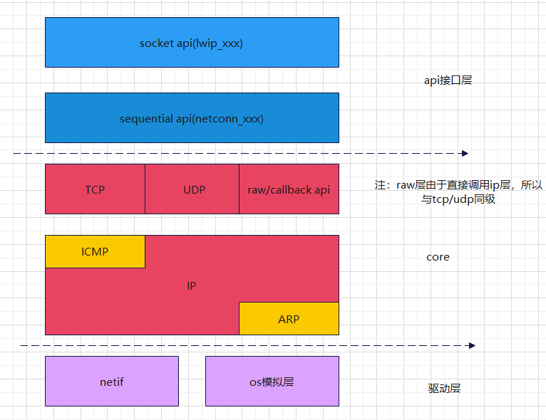
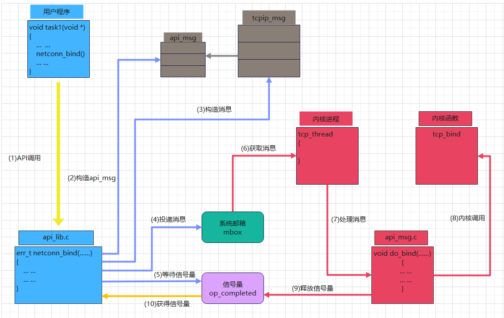
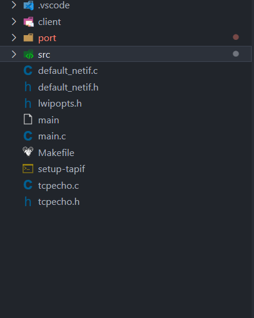
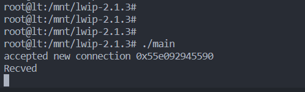
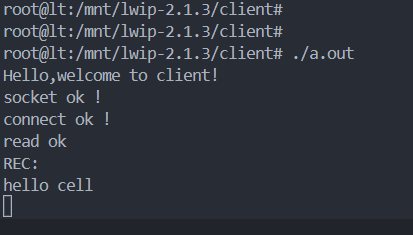
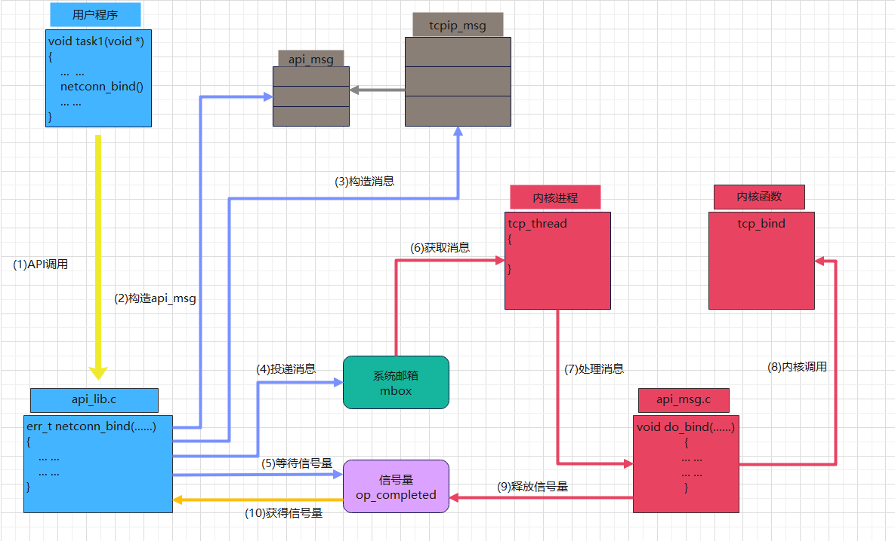

LWIP协议栈设计
===

### 1.总览

​		提到协议栈，我们首先应该明确的是，协议栈应该以何种方式工作在操作系统上？

#### 1.1 进程模型

​		1.独立进程模型

​		TCP/IP 协议族的每一个协议作为一个独立的进程存在。这种模型，必须符合协议的每一层，同时必须指定协议之间的通讯点。虽然，这种实现方法有它的优势，比如每一种协议可以随时参与到系统运行中，代码比较容易理解，调试方便，但是它的缺点也很明显。像前文描述过的，这种进程模型并不是最好的 TCP/IP 协议实现方法。同样更重要的是，数据跨层传递时将不得不产生进程切换（ context switch）。对于接收一个 TCP 段来说，将会引起三次进程切换，从网络设备驱动层进程到 IP 进程，从 IP 进程到 TCP 进程，最终到应用层进程。对于大部分操作系统来说，进程切换得代价可是相当昂贵的。  

​		2.驻留内核

​		协议栈驻留在操作系统内核中，应用进程通过系统调用与协议栈通讯。各层协议不必被严格的区分，但可以使用交叉协议分层技术，linux内核协议栈通常采用这种实现方式。

​		3.单进程

​		LwIP 则采取将所有协议驻留在同一个进程的方式，以便独立于操作系统内核之外。应用程序既可以驻留在 LwIP 的进程中，也可以使用一个单独的进程。应用程序与 TCP/IP 协议栈通讯可以采用两种方法：一种是函数调用，这适用于应用程序与 LwIP 使用同一个进程的情况；另一种是使用更抽象的 API。  

#### 1.2 目录结构

​		以最新的lwip-2.1.3为例：

doc:主要存放的是一些指导文档

test:一些软件测试用例

src: 

- api 
     - api_lib.c     LWIP协议栈API(sequential API)的实现文件
     - api_msg.c  内核接口函数，与协议栈API(sequential API)相对应
     - sockets.c   socket api 函数
     - tcpip.c  协议栈主进程相关函数
- apps 一些应用层程序的实现
- core  主要的内核源代码
- include  所有的头文件存放目录
- netif   底层网卡驱动的实现

#### 1.3 运行

通常LWIP系统需要三个进程：

- 上层应用程序进程
- LWIP协议栈进程
- 硬件数据包的接收发送进程

​	这里所谓三个进程，在嵌入式系统中就是三个线程。理解这个非常重要，线程是可以共享进程资源，线程之间的消息传递可以通过指针传递，而进程之间就不能共享指针传递数据。举例如下：

邮箱投递：

```c
TCPIP_MSG_VAR_ALLOC(msg);
TCPIP_MSG_VAR_REF(msg).type = TCPIP_MSG_API;
TCPIP_MSG_VAR_REF(msg).msg.api_msg.function = fn;
TCPIP_MSG_VAR_REF(msg).msg.api_msg.msg = apimsg;
sys_mbox_post(&tcpip_mbox, &TCPIP_MSG_VAR_REF(msg));
```

协议栈接收线程：

```
 LWIP_DEBUGF(TCPIP_DEBUG, ("tcpip_thread: API message %p\n", (void *)msg));
 msg->msg.api_msg.function(msg->msg.api_msg.msg);
```

明显看出，使用一个msg结构体存放函数指针和参数指针，通过这种方式从网卡线程切换到协议栈线程。而这种方式是没法在两个进程中实现的，及回调函数不能夸进程调用。首先上层应用调用协议栈api函数，协议栈API函数做相关处理后，发送邮箱进行消息投递，然后阻塞等待协议栈线程处理，协议栈线程收到数据，调用与之对应的内核接口进行处理，结果要么网卡发送，要么返回应用程序，应用收到结果，退出阻塞。




#### 1.4  API接口

##### 1.API接口的组成

​		LwIP 的 API 的实现主要有两部分组成：一部分驻留在用户进程中，一部分驻留在 TCP/IP协议栈进程中。这两个部分间通过操作系统模拟层提供的进程通信机制(IPC)进行通信，从而完成用户进程与协议栈间的通信， IPC 包括共享内存、消息传递和信号量。通常尽可能多的工作在用户进程内的 API 部分实现，例如运算量及时间开销大的工作； TCP/IP 协议栈进程中的 API 部分只完成少量的工作，主要是完成进程间的通讯工作。两部分 API 之间通过共享内存传递数据，对于共享内存区的描述是采用和 pbuf 类似的结构来实现。综上，可以用简单的一段话来描述这种 API 实现的机制： API 函数库中处理网络连接的函数驻留在TCP/IP 进程中。位于应用程序进程中的 API 函数使用邮箱这种通讯协议向驻留在 TCP/IP 进程中的 API 函数传递消息。这个消息包括需要协议栈执行的操作类型及相关参数。驻留在TCP/IP 进程中的 API 函数执行这个操作并通过消息传递向应用程序返回操作结果。  

##### 2.API接口组成

lwip通常提供三种形式的API：

- raw/callback API编程接口

- LWIP协议栈API(sequential API)

- BSD socket编程接口

     

##### 3.三种API所在的架构层次：



##### 4.LWIP协议栈API(sequential API)的一次调用过程：




### 2.linux上的移植

​		为了方便 LwIP 移植，属于操作系统的函数调用及数据结构并没有在代码中直接使用，而是用操作系统模拟层来代替对这些函数的使用。操作系统模拟层使用统一的接口提供定时器、进程同步及消息传递机制等诸如此类的系统服务。原则上，移植 LwIP，只需针对目标操作系统修改模拟层实现即可。

​		其实选择linux，一是官方给了移植例程，只需要作很少的工作，二是不需要其他额外的嵌入式设备，就可以调试运行。接下来就正式开始移植工作。

#### 2.1下载源码和例程文件

​		去官网获取最新的文件，截止目前，最新版本为 lwip-2.1.3  contrib-2.1.0  可能有读者好奇，为何有两个不同文件，这里解释一下，官方为了把例程从源码剥离，特意在lwip-2.1.3 存放源码，说明文档和test;而在contrib-2.1.0中存放demo例程。官网网址：https://savannah.nongnu.org/projects/lwip/

#### 2.2移植

复制 lwip-2.1.3 下的src目录， 

复制 contrib-2.1.0\ports\unix 下的 port ,

复制  contrib-2.1.0\ports\win32\example_app 下的 default_netif.c

复制 contrib-2.1.0\examples\example_app 下的 default_netif.h

复制 contrib-2.1.0\apps\tcpecho下的  tcpecho.c tcpecho.h

复制 contrib-2.1.0\ports\unix  下的 setup-tapif  

新建 lwipopts.h   ,内容如下

```c
//lwipopts.h
#ifndef LWIPOPTS_H
#define LWIPOPTS_H
#define LWIP_IPV4                  1
#define NO_SYS                     0
#define LWIP_SOCKET                (NO_SYS==0)
#define LWIP_NETCONN               (NO_SYS==0)
#define LWIP_NETIF_API             (NO_SYS==0)
#endif /* LWIP_LWIPOPTS_H */
```

新建 main.c ，内容如下

```c
/* C runtime includes */
#include <stdio.h>
#include <stdarg.h>
#include <time.h>
#include <string.h>

/* lwIP core includes */
#include "lwip/opt.h"
#include "lwip/sys.h"
#include "lwip/timeouts.h"
#include "lwip/debug.h"
#include "lwip/stats.h"
#include "lwip/init.h"
#include "lwip/tcpip.h"
#include "lwip/netif.h"
#include "lwip/api.h"

#include "lwip/tcp.h"
#include "lwip/udp.h"
#include "lwip/dns.h"
#include "lwip/dhcp.h"
#include "lwip/autoip.h"
#include "tcpecho.h"
#include "lwip/ip.h"
#include "default_netif.h"

ip4_addr_t ipaddr, netmask, gw;

static void
test_init(void *arg)
{ 
	LWIP_UNUSED_ARG(arg);
	sys_sem_t *init_sem;
	LWIP_ASSERT("arg != NULL", arg != NULL);
	init_sem = (sys_sem_t *)arg;
	srand((unsigned int)time(0));
	IP4_ADDR(&gw,192,168,0,1);
	IP4_ADDR(&ipaddr,192,168,0,100);
	IP4_ADDR(&netmask,255,255,255,0);
	init_default_netif(&ipaddr,&netmask,&gw); //启动网卡程序进程
	sys_sem_signal(init_sem);
}

int main(void)
{
	setvbuf(stdout, NULL, _IONBF, 0);
	err_t err;
	sys_sem_t init_sem;
	err = sys_sem_new(&init_sem, 0);
	LWIP_ASSERT("failed to create init_sem", err == ERR_OK);
	LWIP_UNUSED_ARG(err);
	tcpip_init(test_init, &init_sem); //启动协议栈内核进程
	sys_sem_wait(&init_sem);
	sys_sem_free(&init_sem);
	tcpecho_thread(NULL);//注意，demo中的tcpecho.c为static,所以要去掉static,并在tcpecho.h中声明
	default_netif_shutdown();
	return 0;
}
```

新建makefile文件

```makefile
#makefile
LWIPDIR=/mnt/lwip-2.1.3/src
LWIPPPRT=/mnt/lwip-2.1.3/port

CFLAGS=-I/mnt/lwip-2.1.3 -I/mnt/lwip-2.1.3/src/include  \
		-I/mnt/lwip-2.1.3/port/include 
#切记 LWIPDIR LWIPPPRT CFLAGS 要改为自己对应的目录

COREFILES=$(LWIPDIR)/core/init.c \
	$(LWIPDIR)/core/def.c \
	$(LWIPDIR)/core/dns.c \
	$(LWIPDIR)/core/inet_chksum.c \
	$(LWIPDIR)/core/ip.c \
	$(LWIPDIR)/core/mem.c \
	$(LWIPDIR)/core/memp.c \
	$(LWIPDIR)/core/netif.c \
	$(LWIPDIR)/core/pbuf.c \
	$(LWIPDIR)/core/raw.c \
	$(LWIPDIR)/core/stats.c \
	$(LWIPDIR)/core/sys.c \
	$(LWIPDIR)/core/altcp.c \
	$(LWIPDIR)/core/altcp_alloc.c \
	$(LWIPDIR)/core/altcp_tcp.c \
	$(LWIPDIR)/core/tcp.c \
	$(LWIPDIR)/core/tcp_in.c \
	$(LWIPDIR)/core/tcp_out.c \
	$(LWIPDIR)/core/timeouts.c \
	$(LWIPDIR)/core/udp.c

CORE4FILES=$(LWIPDIR)/core/ipv4/autoip.c \
	$(LWIPDIR)/core/ipv4/dhcp.c \
	$(LWIPDIR)/core/ipv4/etharp.c \
	$(LWIPDIR)/core/ipv4/icmp.c \
	$(LWIPDIR)/core/ipv4/igmp.c \
	$(LWIPDIR)/core/ipv4/ip4_frag.c \
	$(LWIPDIR)/core/ipv4/ip4.c \
	$(LWIPDIR)/core/ipv4/ip4_addr.c


# APIFILES: The files which implement the sequential and socket APIs.
APIFILES=$(LWIPDIR)/api/api_lib.c \
	$(LWIPDIR)/api/api_msg.c \
	$(LWIPDIR)/api/err.c \
	$(LWIPDIR)/api/if_api.c \
	$(LWIPDIR)/api/netbuf.c \
	$(LWIPDIR)/api/netdb.c \
	$(LWIPDIR)/api/netifapi.c \
	$(LWIPDIR)/api/sockets.c \
	$(LWIPDIR)/api/tcpip.c


# NETIFFILES: Files implementing various generic network interface functions
NETIFFILES=$(LWIPDIR)/netif/ethernet.c \
	$(LWIPDIR)/netif/bridgeif.c \
	$(LWIPDIR)/netif/bridgeif_fdb.c 

# NETIFFILES: Files implementing various generic network interface functions
NETIF=$(LWIPPPRT)/netif/tapif.c \
	$(LWIPPPRT)/perf.c \
	$(LWIPPPRT)/sys_arch.c 
main:
	gcc $(CFLAGS) -g -o main  main.c default_netif.c  \
	tcpecho.c  $(COREFILES) $(CORE4FILES) $(APIFILES) $(NETIFFILES) $(NETIF) -lpthread 
clean:
	rm -f main
.PHONY:clean
```

完成移植后对应的文件目录如下：笔者为了方便测试，增加了一个client目录，存放tcp客户端。



client.c的源码

```c
#include <stdlib.h>
#include <stdio.h>
#include <sys/socket.h>
#include <netinet/in.h>
#include <string.h>

//ip地址和端口号 一定要和 tcpecho相对应，否则肯定测试不通过
#define ser_ip "192.168.0.100"   //改为对方的ip
unsigned short portnum = 7000;  //

char data[]="hello cell";
int main(int argc, char **argv)
{
	int cfd;
	int recbyte;
	int sin_size;
	char buffer[1024] = {0};
	struct sockaddr_in s_add, c_add;
	printf("Hello,welcome to client!\r\n");
	cfd = socket(AF_INET, SOCK_STREAM, 0);
	if(-1 == cfd)
	{
			printf("socket fail ! \r\n");
			return -1;
	}

	printf("socket ok !\r\n");

	bzero(&s_add,sizeof(struct sockaddr_in));
	s_add.sin_family=AF_INET;
	s_add.sin_addr.s_addr= inet_addr(ser_ip);
	s_add.sin_port=htons(portnum);
	//printf("s_addr = %#x ,port : %#x\r\n",s_add.sin_addr.s_addr,s_add.sin_port);
	if(-1 == connect(cfd,(struct sockaddr *)(&s_add), sizeof(struct sockaddr)))
	{
			printf("connect fail !\r\n");
			return -1;
	}
	printf("connect ok !\r\n");
	if(send(cfd,data,strlen(data),0)<0)
	{
		perror("send fail:");
	}
	while(1)
	{
			if(-1 == (recbyte = recv(cfd, buffer, 1024,0)))
			{
					printf("read data fail !\r\n");
					return -1;
			}
			printf("read ok\r\nREC:\r\n");
			 buffer[recbyte]='\0';
			 printf("%s\n",buffer);	
	}
	close(cfd);
	return 0;
}
```

#### 2.3运行：

​	首先执行 setup-tapif ,注意 tap0地址和gw 一定要相同，否则驱动不能正常读出网卡数据，我这边就在这卡了一天时间。然后执行makefile，接下来运行./main  和client 文件中的 ./a.out。

```shell
sudo ip addr add 192.168.0.1/24 dev tap0 #注意一定要和 gw 地址相同
```

```c
IP4_ADDR(&gw,192,168,0,1);
IP4_ADDR(&ipaddr,192,168,0,100); //与网关的网段相同
IP4_ADDR(&netmask,255,255,255,0);
```

4.运行截图：





到此为止，整个运行移植过程就完成了。0:20,该休息啦，明天接着写。

### 3.内存管理

​		LWIP 中常用到的内存分配策略有两种，一种是内存堆分配，一种是内存池分配。前者可以说能随心所欲的分配我们需要的合理大小的内存块，缺点是当经过多次的分配释放后，内存堆中间会出现很多碎片，使得需要分配较大内存块时分配失败；后者分配速度快，就是简单的链表操作，因为各种类型的 POOL 是我们事先建立好的，但是采用 POOL 会有些情况下会浪费掉一定的内存空间。在 LWIP 中，将这两种分配策略混合使用，达到了很好的内存使用效率。  

​		在协议栈中移动的数据包，最无疑的是整个内存管理中最重要的部分了。数据包的种类和大小也可以说是五花八门，数数，首先从网卡上来的原始数据包，它可以是长达上千个字节的 TCP 数据包，也可以是仅有几个字节的 ICMP 数据包；再从要发送的数据包看，上层应用可能将自己要发送的千奇百怪形态各异的数据包递交给 LWIP 协议栈发送，这些数据可能存在于应用程序管理的内存空间内，也可能存在于某个 ROM 上。注意，这里有个核心的东西是当数据在各层之间传递时， LWIP 极力禁止数据的拷贝工作，因为这样会耗费大量的时间和内存。综上， LWIP 必须有个高效的数据包管理核心，它即能海纳百川似的兼容各种
类型的数据，又能避免在各层之间的复制数据的巨大开销。  

```
//数据包管理结构
struct pbuf {
struct pbuf *next;
void *payload;
u16_t tot_len;
u16_t len;
u8_t type;
u8_t flags;
u16_t ref;
};
```

pbuf 有四类： PBUF_RAM、 PBUF_ROM、 PBUF_REF和 PBUF_POOL。下面，一个一个的来看看各种类型的特点。  

​		PBUF_RAM 类型的 pbuf 主要通过内存堆分配得到的。这种类型的 pbuf 在协议栈中是用得最多的。协议栈要发送的数据和应用程序要传递的数据一般都采用这个形式。申请PBUF_RAM 类型时，协议栈会在内存堆中分配相应的大小，注意，这里的大小包括如前所述的 pbuf 结构头大小和相应数据缓冲区，他们是在一片连续的内存区的。  

​		PBUF_POOL 类型和 PBUF_RAM 类型的 pbuf 有很大的相似之处，但它主要通过内存池分配得到的。这种类型的 pbuf 可以在极短的时间内得到分配。在接受数据包时， LWIP 一般采用这种方式包装数据。申请 PBUF_POOL 类型时，协议栈会在内存池中分配适当的内存池个数以满足需要的申请大小。  

​		PBUF_ROM 和 PBUF_REF 类型的 pbuf 基本相同，它们的申请都是在内存堆中分配一个相应的 pbuf 结构头，而不申请数据区的空间。这就是它们与 PBUF_RAM 和 PBUF_POOL 的最大区别。 PBUF_ROM 和 PBUF_REF 类型的区别在于前者指向 ROM 空间内的某段数据，而后者指向 RAM 空间内的某段数据。  

### 4.网络接口

​		在 LwIP，物理网络硬件的设备驱动通过一个与 BSD 中相似的网络接口结构来表示。网络接口保存在一个全局链表中，它们通过结构体中的 next 指针连接。每一个网络网络接口都拥有一个名字，保存在 name 字段。两个字符的名字标识网络接口使用的设备驱动的种类并且只用于这个接口在运行时由人工操作进行配置的情况。名字由设备驱动来设置并且应该反映通过网络接口表示的硬件的种类。比如蓝牙设备（ bluetooth）的网络接口名字可以是 bt，而 IEEE 802.11b WLAN 设备的名字就可以是 wl。既然网络接口的名字不必具有唯一性，因此 num 字段被用来区分相同类别的不同网络接口。三个 IP 地址 ip_addr， netmask 与 gw 用于 IP 层发送和接收信息包，有关它们的具体使用说明见下一节。一个网络接口只能拥有一个 IP 地址，每一个 IP 地址应当创建一个网络接
口。当收到一个信息包时，设备驱动程序调用 input 指针指向的函数。网络接口通过 output 指针连接到设备驱动。这个指针指向设备驱动中一个向物理网络发送信息包的函数，当信息包被发送时由 IP 层调用。这个字段由设备驱动的初始设置函数填充。 output 函数的第三个参数 ipaddr 是应该接收实际的链路层帧的主机的 IP 地址。它不必与 IP 信息包的目的地址相同。特别地，当要发送 IP 信息包到一个并不在本地网络里的主机上时，链路层帧会被发送到网络里的一个路由器上。在这种情况下，给 output 函数的 IP地址将是这个路由器的地址。最后， state 指针指向网络接口的设备驱动特定状态，它由设备驱动设置。  

```c
struct netif {
struct netif *next;
char name[2];
int num;
struct ip_addr ip_addr;
struct ip_addr netmask;
struct ip_addr gw;
void (* input)(struct pbuf *p, struct netif *inp);
int (* output)(struct netif *netif, struct pbuf *p,
struct ip_addr *ipaddr);
void *state;
};
```

### 5.ARP

​		ARP 协议实现的核心是 ARP 缓存表， ARP 的实质就是对缓存表的建立、更新、查询等操作。 ARP 缓存表是由一个个的缓存表项（ entry）组成的， LWIP 中描述缓存表项的数据结构叫 etharp_entry，源代码：  

```c
struct etharp_entry {
#if ARP_QUEUEING
struct etharp_q_entry *q; // 数据包缓冲队列指针
#endif
struct ip_addr ipaddr; // 目标 IP 地址
struct eth_addr ethaddr; // MAC 地址
enum etharp_state state; // 描述该 entry 的状态
u8_t ctime; // 描述该 entry 的时间信息
struct netif *netif; // 相应网络接口信息
};
```

```
//LWIP 内核通过数组的方式来创建 ARP 缓存表，如下，
static struct etharp_entry arp_table[ARP_TABLE_SIZE];
```

​	ARP协议的结构体表述：

```c
struct etharp_hdr {
PACK_STRUCT_FIELD(struct eth_hdr ethhdr); // 14 字节的以太网数据报头
PACK_STRUCT_FIELD(u16_t hwtype); // 2 字节的硬件类型
PACK_STRUCT_FIELD(u16_t proto); // 2 字节的协议类型
PACK_STRUCT_FIELD(u16_t _hwlen_protolen); // 两个 1 字节的长度字段
PACK_STRUCT_FIELD(u16_t opcode); // 2 字节的操作字段 op
PACK_STRUCT_FIELD(struct eth_addr shwaddr); // 6 字节源 MAC 地址
PACK_STRUCT_FIELD(struct ip_addr2 sipaddr); // 4 字节源 IP 地址
PACK_STRUCT_FIELD(struct eth_addr dhwaddr); // 6 字节目的 MAC 地址
PACK_STRUCT_FIELD(struct ip_addr2 dipaddr); // 4 字节目的 IP 地址
} PACK_STRUCT_STRUCT;
```

PACK_STRUCT_FIELD()是防止编译器字对齐的宏定义  

### 6.IP处理

现在来看看 LWIP 中是怎么样来描述这个 IP 数据报头的，使用的结构体叫 ip_hdr：  

```
struct ip_hdr {
PACK_STRUCT_FIELD(u16_t _v_hl_tos); // 前三个字段：版本号、首部长度、服务类型
PACK_STRUCT_FIELD(u16_t _len); // 总长度
PACK_STRUCT_FIELD(u16_t _id); // 标识字段
PACK_STRUCT_FIELD(u16_t _offset); // 3 位标志和 13 位片偏移字段
#define IP_RF 0x8000 //
#define IP_DF 0x4000 // 不分组标识位掩码
#define IP_MF 0x2000 // 后续有分组到来标识位掩码
#define IP_OFFMASK 0x1fff // 获取 13 位片偏移字段的掩码
PACK_STRUCT_FIELD(u16_t _ttl_proto); // TTL 字段和协议字段
PACK_STRUCT_FIELD(u16_t _chksum); // 首部校验和字段
PACK_STRUCT_FIELD(struct ip_addr src); // 源 IP 地址
PACK_STRUCT_FIELD(struct ip_addr dest); // 目的 IP 地址
} PACK_STRUCT_STRUCT;
```

### 7. ICMP

暂时未深入研究

### 8.UDP处理

暂时未深入研究

### 9.TCP处理

暂时未深入研究

### 10.用户编程接口

#### 10.1 接口设计

​		raw/callback API编程接口虽然可以使得程序效率高、灵活性好，但是仍然存在一定的缺陷，使其不适合在多任务、交互数据量大、数据处理时间开销长等场景下使用。

​		BSD socket编程时，在应用程序进程和协议栈内核进程之间会出现数据拷贝的情况，因为操作系统人为他们是两个相互独立的进程，应该使用相互独立的资源。

​		如果可以避免上述数据拷贝的情况，那么应用程序的效率将会有很大的提高，因为拷贝消耗的时间和空间对操作系统来说都是非常宝贵的资源，尤其是在嵌入式系统中。LWIP协议栈API(sequential API)基于上述特点而设计。

​		LwIP 的内部机制讲解完了，接下来是应用程序与 LwIP 之间的结构问题，即应用程序如何使用协议栈内部提供的各种服务。应用程序可以通过两种方式与协议栈交互：一是直接调用协议栈各个模块函数，二是利用 LwIP 提供的 API 函数。直接调用协议栈内部各模块函数，即要创建一个 TCP 控制块时则调用函数 tcp_new，进行 TCP 连接时则调用 tcp_connect，要接收数据则要向控制块中注册相关的回调函数，等等。通过这种方式的交互最大的缺点就是代码编写难度大，且代码常常是晦涩难懂，代码的调试也会异常艰辛。使用得更多的也是我更关注的，就是第二种方式： LwIP 的 API 函数。用户程序通过简单的 API 函数调用就可以享用协议栈提供的服务了，这使得应用程序的编写更加容易。 LwIP的 API 相比 BSD 实现的 API 有个明显的特点，即数据在协议栈与应用程序中交互时不用拷贝，这点可以为我们节省大量的时间和内存开销，也说明 LwIP 更适用于嵌入式这种系统资源受限的系统。但有个关键是，我们必须有个好的内存管理机制，因为协议栈和应用程序都会对同一片数据进行操作。
​		LwIP 的 API 的实现主要有两部分组成：一部分驻留在用户进程中，一部分驻留在 TCP/IP协议栈进程中。这两个部分间通过操作系统模拟层提供的进程通信机制(IPC)进行通信，从而完成用户进程与协议栈间的通信， IPC 包括共享内存、消息传递和信号量。通常尽可能多的工作在用户进程内的 API 部分实现，例如运算量及时间开销大的工作； TCP/IP 协议栈进程中的 API 部分只完成少量的工作，主要是完成进程间的通讯工作。两部分 API 之间通过共享内存传递数据，对于共享内存区的描述是采用和 pbuf 类似的结构来实现。综上，可以用简单的一段话来描述这种 API 实现的机制： API 函数库中处理网络连接的函数驻留在TCP/IP 进程中。位于应用程序进程中的 API 函数使用邮箱这种通讯协议向驻留在 TCP/IP 进程中的 API 函数传递消息。这个消息包括需要协议栈执行的操作类型及相关参数。驻留在TCP/IP 进程中的 API 函数执行这个操作并通过消息传递向应用程序返回操作结果。  

#### 10.2 协议栈API一次调用




### 11.代码统计分析

#### 11.1 代码行

|       模块        | 占比 |
| :---------------: | :--: |
|        TCP        | 42%  |
| Support functions | 21%  |
|        API        | 20%  |
|        IP         |  7%  |
|        UDP        |  6%  |
|       ICMP        |  3%  |

​		支撑函数（Support functions） 部分包括缓冲和内存管理函数， 还包括 Internet校验和计算函数。校验和函数使用普通的 C 算法实现，在实际配置时，应根据处理器的不同实现针对性的算法来取代普通的 C 算法实现。API 类包括两部分，一部分是应用程序 API，另一部分为 TCP/IP 协议栈 API。操作系统模拟层并没有包含在此次分析中，因为其大小完全依赖于所使用底层操作系统的不同而不同，所以没必要进行比较。


